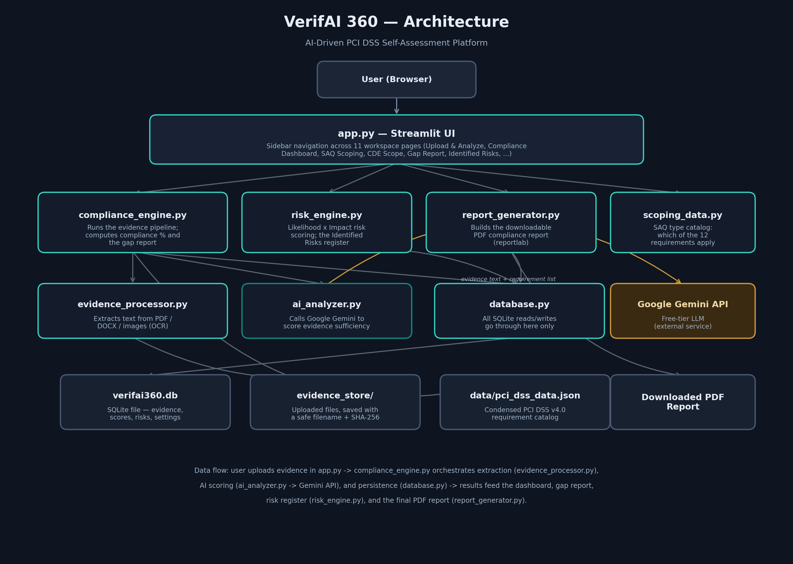

# VerifAI 360 — AI-Driven PCI DSS Self-Assessment Platform

Team members: Amr Mohamed El Sayed, Nazly Mohamed Samir, Youssef Ahmed Mohamed,
Asmaa Ibrahim, Ahmed Emad El Din, Mohamed Hussein El Naggar, Mostafa Ahmed Mostafa.
Mentor: Mostafa ElKady.

---

## 1. What this project is, in one paragraph

PCI DSS is a security standard that any company handling credit-card data
must follow. Proving you follow it usually means manually reading a long
checklist and manually deciding, for every single item, "do we have proof
of this, and is that proof good enough?" **VerifAI 360 automates that
manual judgment call.** You upload a piece of evidence (a policy document,
a firewall screenshot, a vulnerability scan report...), and an AI model
reads it, decides which requirement(s) it actually proves, scores how
convincing it is, and tells you what's missing. The app then turns all of
those individual scores into one overall compliance percentage, a list of
gaps, a risk register, and a downloadable PDF report.

---

## 2. Architecture — how the pieces fit together



**How to read this diagram, top to bottom:**

1. **User (Browser)** — you open `http://localhost:8501` in a normal web
   browser. There's no separate mobile app or desktop app.
2. **`app.py` — Streamlit UI** — the only file that draws screens. It has
   no business logic of its own; every page just asks the modules below it
   for data and displays whatever comes back.
3. **The four "core" modules** — each owns one job:
   - `compliance_engine.py` runs the evidence pipeline and computes scores.
   - `risk_engine.py` turns gaps into a scored risk register.
   - `report_generator.py` renders the final PDF.
   - `scoping_data.py` is just a lookup table (no logic) of which PCI DSS
     requirements apply to which SAQ type.
4. **The three "support" modules** — the actual heavy lifting:
   - `evidence_processor.py` turns a file (PDF/DOCX/image) into plain text.
   - `ai_analyzer.py` sends that text to Google's Gemini AI and gets a score back.
   - `database.py` is the *only* file allowed to talk to the SQLite database.
5. **External service** — `ai_analyzer.py` is the one place in the whole
   app that makes a network call to something outside your own computer:
   Google's Gemini API (free tier, no credit card required).
6. **Storage, on your own disk** — three plain files/folders that hold all
   persistent data: the SQLite database (`verifai360.db`), the folder of
   uploaded files (`evidence_store/`), and the static requirement catalog
   (`data/pci_dss_data.json`). Nothing is stored in the cloud unless you
   choose to deploy the app somewhere yourself.

**One evidence upload, start to finish:**

```
User picks a file on the "Upload & Analyze" page
        │
        ▼
compliance_engine.process_uploaded_evidence()
        │
        ├─► evidence_processor.extract_text()   → turns the file into plain text
        │
        ├─► ai_analyzer.analyze_evidence()       → sends the text + requirement
        │        │                                  catalog to Gemini, gets back
        │        ▼                                  a JSON score for every
        │   Google Gemini API                       relevant sub-requirement
        │
        └─► database.insert_evidence() / insert_assessment()
                 → saves the file record + every score to verifai360.db
        │
        ▼
Dashboard / Gap Report / Risk pages now reflect the new score automatically
(they just re-read the database every time they're viewed)
```

---

## 3. What the app actually does, step by step

1. **Extracts** the text/content from the file (PDF, DOCX, image via OCR, or plain text).
2. **Sends it to Gemini** (Google AI Studio's **free** API tier — no credit
   card, no cost) with a condensed PCI DSS v4.0-style requirement catalog
   and asks the model to:
   - Score how **sufficient** the evidence is against each sub-requirement it's
     relevant to (0–100), and label a maturity level.
   - Identify **cross-requirement spanning** — the same evidence can satisfy
     more than one sub-requirement at once.
   - List **gaps** and **actionable recommendations**.
3. **Persists** every assessment in a local SQLite database, so scores
   accumulate across multiple uploads (continuous maturity scoring).
4. **Aggregates** everything into an overall compliance %, per-requirement %,
   a gap report, and a maturity trend chart — all in a Streamlit dashboard.
5. **Scores risk**: every open gap can be synced into **Identified Risks**,
   scored on a standard 5×5 Likelihood × Impact matrix (1–25, bucketed into
   Low/Medium/High/Critical), with an owner, status, and mitigation plan you
   can track over time. See "Risk scoring & Identified Risks" below.
6. **Exports a full PDF report**: one document with the executive summary,
   per-requirement compliance scores, the gap report with remediation
   steps, the identified-risks register, and the evidence log with
   per-file SHA-256 integrity hashes. Download it from the Compliance
   Dashboard page or the QSA Audit View page.

---

## 4. File-by-file guide (plain English)

| File | What it's for, in one sentence |
|---|---|
| `app.py` | The entire user interface — every screen you see is drawn from here. Contains almost no logic of its own. |
| `src/database.py` | The only file that reads/writes the SQLite database. Every table has simple `insert_x()` / `update_x()` / `delete_x()` / `get_all_x()` functions, plus `insert_call_log()` / `get_all_call_log()` for the analysis audit trail. |
| `src/evidence_processor.py` | Converts an uploaded file into plain text — reads PDFs/Word docs directly, OCRs screenshots/scanned pages using Tesseract, and validates each file's actual byte signature against its claimed extension before any of that (`validate_file_signature()`). |
| `src/ai_analyzer.py` | Talks to the Google Gemini API. Builds the prompt, sends the evidence text, and validates the JSON that comes back. Includes retry logic and multi-key failover. |
| `src/local_analyzer.py` | A fully offline, deterministic alternative to `ai_analyzer.py` — scores evidence via curated-keyword/vocabulary matching against `data/pci_dss_data.json` (with typo-tolerant fuzzy matching and negation-awareness, so "we have no firewall policy" isn't scored as evidence a firewall policy exists), no network call, no data leaves the machine. |
| `src/security.py` | The app-level passcode gate and Fernet encryption-at-rest for evidence files/text (see README section 12). |
| `src/data_portability.py` | Full-state JSON export/import of every database table, for backup or moving an assessment to another machine. |
| `src/compliance_engine.py` | The "orchestrator": runs a full evidence upload end-to-end, and turns raw scores into the overall compliance percentage and the gap report. |
| `src/risk_engine.py` | Turns a compliance gap into a Likelihood × Impact risk score, and manages the risk register. |
| `src/scoping_data.py` | A static lookup table: for each SAQ type (A, B, C, D, ...), which of the 12 top-level PCI DSS requirements actually apply. |
| `src/report_generator.py` | Builds the downloadable PDF report using the `reportlab` library — no browser or external renderer needed. |
| `data/pci_dss_data.json` | The condensed PCI DSS requirement catalog the whole app is built around (see the accuracy disclaimer below). |
| `verifai360.db` | The SQLite database file itself — created automatically the first time you run the app. |
| `evidence_store/` | Every uploaded file gets copied here, renamed with a timestamp + sanitized filename, then encrypted at rest. |
| `config.toml` | Streamlit's native theme settings (dark mode, accent color) plus the server-side upload size cap. |

Every source file under `src/` starts with a docstring explaining its
purpose in more depth, and `app.py` has a short plain-English comment above
each page section explaining what that screen does and which module
actually computes its numbers — start there if you want to trace a
specific feature back to its code.

---

## 5. Risk scoring & Identified Risks

`src/risk_engine.py` adds a lightweight GRC layer on top of the compliance
engine:

- **Likelihood (1–5)** is derived from a sub-requirement's current AI
  sufficiency score — less/weaker evidence ⇒ higher likelihood the control
  fails when it matters.
- **Impact (1–5)** is a fixed weight per top-level PCI DSS requirement
  (e.g. Req 3 "Protect stored account data" and Req 4 "Encrypt transmission"
  are weighted highest, since they most directly endanger cardholder data).
  These weights are a documented default for this project, **not** an
  official PCI SSC scoring scheme — edit `REQUIREMENT_IMPACT_WEIGHTS` in
  `risk_engine.py` to tune them.
- **Risk score = Likelihood × Impact** (1–25): 1–4 Low, 5–9 Medium,
  10–14 High, 15–25 Critical.
- On the **Identified Risks** page, click "Sync risks from gap report" to
  auto-create/refresh one risk per open gap. You can also add fully manual
  risks (vendor risk, project risk, etc.) unrelated to any gap. Risks you've
  moved to Mitigating/Accepted/Closed are left alone by future syncs.
- The **Compliance Dashboard** shows total open risk exposure and a
  Likelihood×Impact heatmap of currently open/mitigating risks.
- Export the full list to CSV from the Identified Risks page.

---

## 6. ⚠️ Pages marked "(demo)"

Two sidebar pages — **Automated Connectors** and **Alerts & Drift** — are UI
mockups of planned features, clearly labeled as such in-app. Nothing on
those pages reads real data: the "Connected" connector statuses and drift
alerts are illustrative sample data. Treat them as a roadmap sketch, not
working functionality, until they're actually wired up to real
integrations and real diffing logic.

**QSA Audit View** now shows real data end-to-end: the compliance %,
per-file SHA-256 integrity hashes, and the "Generate audit PDF" button are
all live and pulled from your actual database. What's still a roadmap
sketch on that page is the rest of a full QSA workflow (reviewer sign-off,
sampling notes, interview logs, a locked-down read-only auditor login).

---

## 7. ⚠️ Important accuracy disclaimer (please read)

- `data/pci_dss_data.json` is an **original, condensed paraphrase** written for
  this student project. It is **not** a reproduction of the official PCI DSS
  standard and does **not** cover every testing procedure. For any real
  assessment, use the actual PCI DSS v4.0.1 document from the PCI Security
  Standards Council: https://www.pcisecuritystandards.org
- The AI's scoring is an automated, preliminary opinion to speed up
  self-assessment work. It is **not** a Qualified Security Assessor (QSA)
  opinion and does not constitute formal PCI DSS validation.
- Model output can be wrong. Treat every score/recommendation as a
  starting point to verify, not a final answer.

---

## 8. Project structure

```
VerifAI360/
├── app.py                     # Streamlit UI (11 workspace pages + 3 demo pages)
├── docs/
│   └── architecture.png       # the diagram at the top of this README
├── data/
│   └── pci_dss_data.json      # condensed requirement catalog (see disclaimer)
├── src/
│   ├── database.py            # SQLite persistence (evidence, assessments, identified risks, call log)
│   ├── evidence_processor.py  # text/PDF/DOCX/OCR extraction + file-signature validation
│   ├── ai_analyzer.py         # Gemini API call + JSON schema validation + multi-key failover
│   ├── local_analyzer.py      # offline deterministic scoring engine (no network, no data leaves the machine)
│   ├── security.py            # passcode gate + encryption at rest (Fernet)
│   ├── data_portability.py    # full-state JSON export/import
│   ├── compliance_engine.py   # scoring aggregation + gap report + SHA-256 integrity hashing
│   ├── risk_engine.py         # risk scoring (Likelihood x Impact) + identified risks
│   └── report_generator.py    # full PDF compliance report (reportlab)
├── evidence_store/            # uploaded files get copied here (encrypted at rest)
├── requirements.txt
└── .env.example
```

---

## 9. Design system

The app uses a custom dark theme (`config.toml` for the native
Streamlit theme + injected CSS in `app.py` for cards, badges, and the
page-header component) rather than default Streamlit styling. Key pieces
if you're extending a page:
- `page_header(icon, title, subtitle)` — use this instead of `st.title()`
  at the top of every page, for a consistent icon + title + subtitle look.
- `risk_badge(level)` / `risk_badge_emoji(level)` — consistent
  Low/Medium/High/Critical styling wherever a risk level is shown.
- `demo_banner(text)` — the amber "🧪 Simulated data" banner used on the
  three roadmap/demo pages.
- The sidebar is intentionally split into two `st.radio` groups
  ("Workspace" vs "Roadmap · Demo") with `on_change` callbacks writing to
  `st.session_state["_active_page"]`, so the page in the second group
  doesn't get silently deselected by an unrelated rerun (e.g. clicking a
  button elsewhere on that same demo page).

---

## 10. Setup

```bash
# 1. Create a virtual environment (recommended)
python3 -m venv venv
source venv/bin/activate        # Windows: venv\Scripts\activate

# 2. Install Python dependencies
pip install -r requirements.txt

# 3. Install the Tesseract OCR engine (needed for image/screenshot evidence)
#    Ubuntu/Debian: sudo apt install tesseract-ocr
#    Fedora:        sudo dnf install tesseract
#    Arch:          sudo pacman -S tesseract
#    macOS:         brew install tesseract
#    Windows:       https://github.com/UB-Mannheim/tesseract/wiki
#
#    The app auto-detects Tesseract on all three OSes (PATH first, then
#    common install locations like C:\Program Files\Tesseract-OCR on
#    Windows or /opt/homebrew/bin on Apple Silicon Macs) — no manual PATH
#    editing needed. If you installed it somewhere non-standard, set
#    TESSERACT_CMD in your .env file to the full path of the binary.

# 4. Get a FREE Gemini API key (no credit card required)
#    -> go to https://aistudio.google.com/apikey, sign in with a Google
#       account, click "Create API key", copy it.
cp .env.example .env
# then edit .env and paste your key next to GOOGLE_API_KEY=
# (optional) set TESSERACT_CMD in .env only if Tesseract isn't auto-detected

# 5. Run the app
streamlit run app.py
```

The app opens at `http://localhost:8501`.

### Why Gemini instead of a paid API

Google AI Studio's Gemini API has a genuinely free tier: no credit card,
no expiration, and (as of this writing) roughly 1,500 requests/day on
`gemini-flash-latest` (the free-tier-eligible Flash model), which is far
more than a student project needs. The code uses the `-latest` alias
rather than pinning a dated model name, since Google periodically retires
older dated models (e.g. `gemini-2.5-flash` stopped accepting new users
in mid-2026) — the alias automatically points at whichever Flash model is
current. The trade-off is that Google may use free-tier prompts/responses
to improve their models (this does not apply to paid tiers), so avoid
uploading real sensitive company data as "evidence" while testing — use
sanitized or sample documents. Free-tier limits can change; if you start
getting quota errors, check the current numbers at
https://ai.google.dev/gemini-api/docs/pricing.

---

## 11. How the "core objectives" map to code

| Objective | Where it happens |
|---|---|
| Automated sufficiency validation + compliance % | `ai_analyzer.analyze_evidence()` scores each sub-requirement; `compliance_engine.compute_compliance_summary()` aggregates it |
| Multi-requirement cross-mapping | The AI prompt explicitly asks for *every* relevant sub-requirement, not just the targeted one; `compliance_engine.process_uploaded_evidence()` persists one row per mapped sub-requirement (`sub_req_assessment` table) |
| Gap identification | `compliance_engine.build_gap_report()` |
| Continuous maturity scoring | `score_history` table + the trend chart on the Dashboard page; each new upload for a sub-requirement adds a new history point, and `_build_prior_context()` feeds prior evidence back into the next AI call so scoring is cumulative, not isolated |
| Risk scoring + identified risks | `risk_engine.py` (Likelihood × Impact scoring) + `risk_register` table; Identified Risks page for sync-from-gaps, manual risks, ownership/status tracking, and CSV export |
| Full PDF report + evidence integrity | `report_generator.generate_pdf_report()` renders the executive summary, per-requirement scores, gap report, risk register, and evidence log (with real per-file SHA-256 hashes computed in `compliance_engine._sha256_of_file()`) into one downloadable PDF |

---

## 12. AI Security & API Security posture

**Implemented:**
- API key loaded from environment only, never hardcoded (`ai_analyzer._get_client()`), with
  automatic failover across multiple keys (`GOOGLE_API_KEY`, `GOOGLE_API_KEY_2`, ... or
  `GOOGLE_API_KEYS="key1,key2"`) when one account's free-tier quota runs out.
- `.gitignore` prevents committing a real `.env`, the local SQLite DB, or the evidence store.
- Evidence file uploads: filenames are sanitized (`os.path.basename` + charset allowlist) before
  being used to build a filesystem path, with a second `os.path.commonpath` check as defense in
  depth — a malicious filename like `../../etc/passwd` cannot escape `evidence_store/`
  (`compliance_engine._safe_stored_filename`).
- **Real per-file SHA-256 integrity hashing** (`compliance_engine._sha256_of_file`): computed from
  the stored file's actual bytes at upload time, stored alongside the evidence record, and shown
  in the Evidence Log, QSA Audit View, and the PDF report — so a hash can be used to verify a file
  on disk hasn't been altered since it was submitted.
- Upload size is capped both at the Streamlit server layer (`config.toml`,
  `maxUploadSize`) and in application code (`compliance_engine.MAX_EVIDENCE_FILE_BYTES`, 25 MB),
  to reduce resource-exhaustion risk from oversized files hitting OCR/PDF parsing.
- **Prompt injection hardening (OWASP LLM01):** evidence text is untrusted, user-supplied content.
  It's wrapped in explicit `<<<EVIDENCE_START>>>` / `<<<EVIDENCE_END>>>` delimiters, any occurrence
  of those literal tokens *inside* the evidence itself is neutralized first (so an attacker can't
  forge a fake "end of evidence" marker to smuggle in new instructions), and the system prompt has
  an explicit, highest-priority rule telling the model to treat everything between the delimiters
  as data to assess, never as instructions to follow — including text that impersonates system/admin
  instructions or tries to dictate a specific score.
- AI output is schema-validated before use (`_parse_json_response`): required fields are checked,
  scores are clamped to 0–100, missing fields get safe defaults.
- Transient-only retry policy: only retryable HTTP statuses (429/500/503/504) trigger backoff;
  everything else (e.g. a malformed request) fails fast instead of retry-looping.
- **Multi-model fallback, not just multi-key.** `MODEL_FALLBACK_CHAIN` in `ai_analyzer.py` is
  actually consulted now: if a model is stuck returning 503 for all its retries, the next model
  in the chain is tried on the *same* key before moving on; a 429 (quota exhausted) still skips
  straight to the next *key* instead of wasting calls on sibling models that share the same quota.
- **Passcode brute-force throttling.** After `security.MAX_FAILED_ATTEMPTS` wrong passcodes from
  the same caller, an increasing lockout (`LOCKOUT_SECONDS`, doubling up to `MAX_LOCKOUT_SECONDS`)
  kicks in. Honest scope note: this is in-process memory keyed by IP (via `st.context.ip_address`,
  falling back to a per-session id) — good enough for the single-process localhost/small-team
  deployment this app targets, not a substitute for a real auth service / WAF rate limiter behind
  a multi-instance deployment.
- **Analysis audit log has a retention cap.** `analysis_call_log` prunes itself down to
  `database.CALL_LOG_MAX_ROWS` (default 5000) on every insert, oldest rows first, so the audit
  trail can't grow completely unbounded on a long-lived deployment.

**Known gaps / recommended next steps (roughly by priority):**
1. ~~No authentication on the app itself.~~ **Resolved** — `src/security.py` adds a
   shared app-level passcode gate (`APP_PASSCODE` in `.env`, auto-generated on first
   run if missing) enforced before any page renders. Still a single shared passcode,
   not full multi-user/role auth — that remains a bigger project if this is ever
   deployed for a real multi-person team.
2. **Sensitive data sent to a free-tier third-party API — mitigated, not eliminated.**
   `src/local_analyzer.py` adds a fully offline, deterministic scoring engine
   (keyword/vocabulary matching against `data/pci_dss_data.json`) as an alternative
   to `ai_analyzer.py` — pick either engine per file on the Upload & Analyze page, and
   local mode never sends evidence text anywhere. If you still want the AI engine's
   deeper semantic read on real, sensitive evidence, the original recommendation
   stands: use a paid Gemini tier with a no-training data-use agreement, or add a
   redaction/anonymization pass before the text is sent — neither of those is built.
3. ~~No encryption at rest for `verifai360.db` or `evidence_store/`.~~ **Resolved** —
   `src/security.py` encrypts each evidence file (in `evidence_store/`) and its
   extracted text excerpt (in the database) with Fernet (AES-128-CBC + HMAC), keyed
   by `ENCRYPTION_KEY` in `.env` (auto-generated on first run if missing). Honest scope
   note: this encrypts the sensitive *content*, not the whole SQLite file — filenames,
   scores, dates, and sub-requirement IDs stay in plain columns because the app needs
   to query/sort/aggregate on them; full-database encryption would need SQLCipher
   (a separate compiled SQLite build, not installable via plain pip here).
4. ~~No audit log of AI calls.~~ **Resolved** — every call to either analysis engine
   (AI or Local), success or failure, is now recorded in the `analysis_call_log`
   table (`database.insert_call_log()` / `get_all_call_log()`, wired in
   `compliance_engine.process_uploaded_evidence()`), capturing the filename, engine,
   model used, target sub-requirement, success/failure, error message, and how many
   sub-requirements were scored. Viewable in-app from the **Evidence Log** page under
   "🧾 Analysis call log (audit trail)".
5. ~~File-type validation is extension-based only.~~ **Resolved** — `evidence_processor.
   validate_file_signature()` checks the actual file bytes (magic-byte signatures for
   PDF, DOCX/ZIP, PNG, JPEG, BMP, TIFF, WEBP) against what the extension claims, and
   `compliance_engine.process_uploaded_evidence()` rejects a mismatch (e.g. a renamed
   file) before it ever reaches pdfplumber/python-docx/pytesseract. Plain-text formats
   (`.txt`/`.log`/`.csv`/`.json`/...) have no fixed signature by design and are still
   trusted as-is — there's no equivalent content check possible for those.
6. ~~Dependencies are unpinned.~~ **Resolved** — `requirements.txt` now pins an exact
   version for every dependency (`==`, not `>=`); update deliberately and re-run the
   test suite rather than picking up an unreviewed transitive update automatically.

---

## 13. Extending this for a real capstone submission

Ideas to go further, if the team wants to extend scope:
- Swap the condensed JSON catalog for a licensed, complete copy of the
  official PCI DSS v4.0.1 requirement/testing-procedure text.
- Add authentication + multi-tenant support (one dataset per client/QSA).
- Add a vector index (e.g. embeddings) over the requirement catalog instead
  of stuffing the whole catalog into the prompt, so it scales to a larger
  standard.
- Add a re-scoring job that periodically re-checks evidence "freshness"
  (e.g. a scan report older than 90 days should decay in score).
- Add an audit log of every AI call (evidence id, timestamp, model, raw
  response) for QSA-style accountability and score-manipulation detection.
- Encrypt `verifai360.db` and `evidence_store/` at rest.
- Validate uploaded files by content/magic bytes, not just extension.
